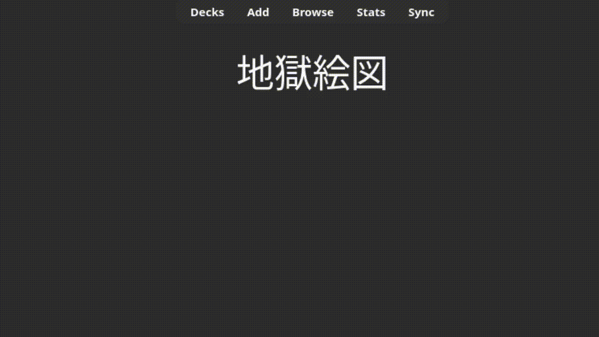
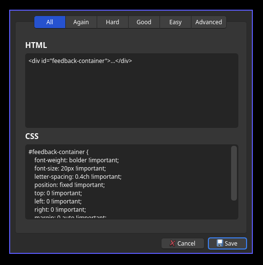
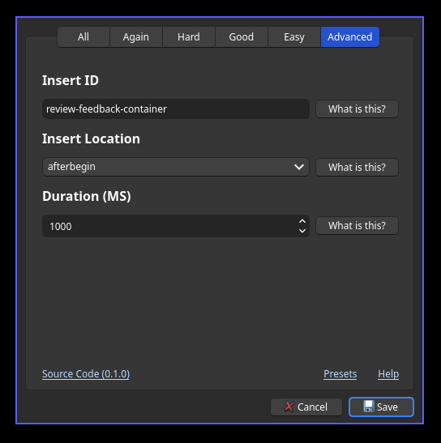

# anki-review-feedback

  

A customizable [Anki](https://apps.ankiweb.net/) plugin which provide feedback after answering a card, similar to AnkiDroid. See [presets.md](docs/presets.md) for alternative presets. The default preset is designed to emulate AnkiDroid's feedback behavior.

<p align="center">
    
    <br />
    <a href="https://ankiweb.net/shared/info/480398359"><i>Plugin URL</i></a>
</p>


## Install

Use the following code to install the plugin (**Tools -> Add-ons -> Get Add-ons**):

```text
480398359
```

Once installed, restart Anki.

## Usage

Access the menu from **Tools -> Configure Review Feedback** or directly edit the JSON in **Tools -> Add-ons -> Review Feedback -> Config**.

<div align="center">

|  |  |
| ---------------------------------------------------| -------------------------------------------------- |

</div>

The first five pages define the HTML and CSS injected when a review is passed. Content in the "all" tab is included with every review. The "advanced" tab can be used to configure the injection ID, duration, and location of the HTML.

## Development

Using `uv` and `Makefile`:

```sh
# Building
make build # Build the Qt designer files
make prune # Prune the built designer files

# Developing
make lint # Lint with mpy
make run # Run Anki

# Releasing
make export # Zip to .ankiaddon
make clean # Clean the exported .ankiaddon files
```

On Unix systems, it's better to just symlink the `addon` directory to Anki's `addons21` directory.

```sh
cd ~/.local/share/Anki2/addons21
ln -s ~/dev/git/anki-review-feedback/addon ./review-feedback
```

This should only be used for development though.

## License

[MIT](LICENSE)
