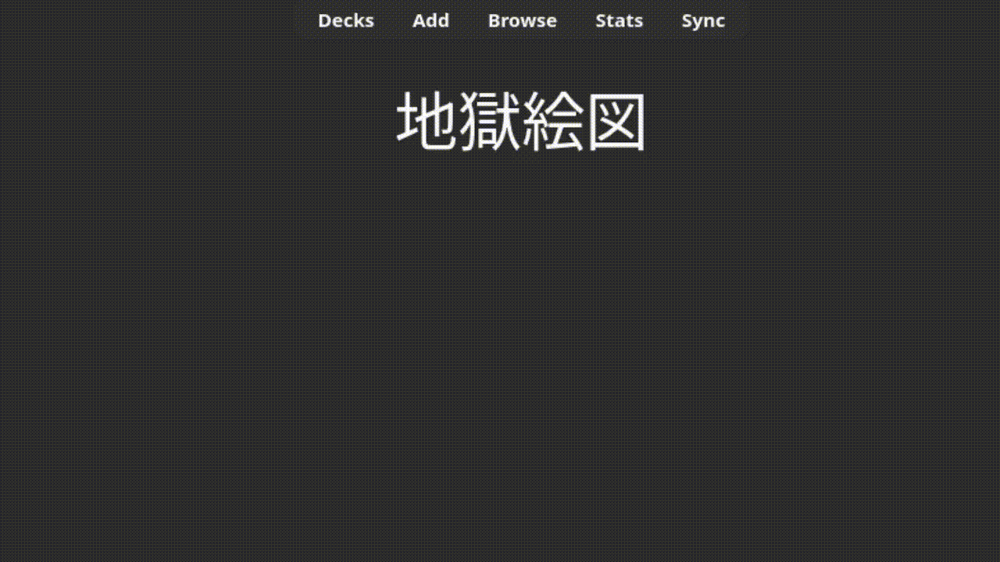

# Feedback Presets

Various presets you can copy and paste. It is recommended to use `!important` to avoid overlapping styles with cards.

## Full



Use `beforeend` as the insert location.

```html
<!-- Again -->
<div id="feedback-container">Again</div>

<!-- Hard -->
<div id="feedback-container">Hard</div>

<!-- Good -->
<div id="feedback-container">Good</div>

<!-- Easy -->
<div id="feedback-container">Easy</div>
```

```css
/* All */
#feedback-container {
    font-weight: bolder !important;
    font-size: 20px !important;
    text-align: center !important;
}

/* Again */
#feedback-container { color: red; }

/* Hard */
#feedback-container { color: white; }

/* Good */
#feedback-container { color: green; }

/* Easy */
#feedback-container { color: blue; }
```

## Partial


Use `afterbegin` as the insert location.

```html
<!-- All -->
<div id="feedback-container">...</div>
```

```css
/* All */
#feedback-container {
    font-weight: bolder !important;
    font-size: 20px !important;
    letter-spacing: 0.4ch !important;
    position: fixed !important;
    top: 0 !important;
    left: 0 !important;
    right: 0 !important;
    margin: 0 auto !important;
    text-align: center !important;
}

/* Again */
#feedback-container { color: red; }

/* Hard */
#feedback-container { color: white; }

/* Good */
#feedback-container { color: green; }

/* Easy */
#feedback-container { color: blue; }
```

